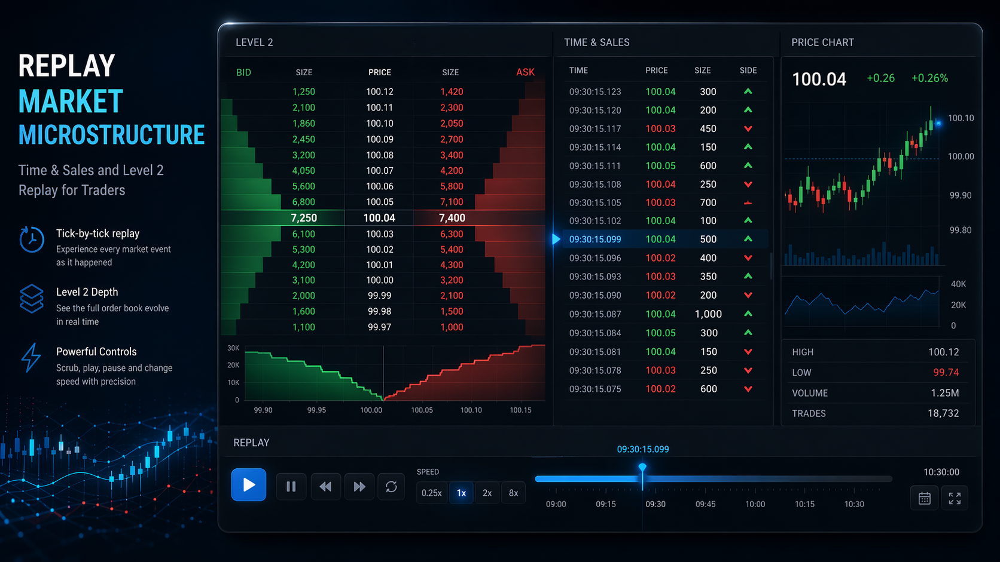

# Market Microstructure Replay

Market Microstructure Replay is a two-part replay workstation for inspecting level-2 order book updates and recent trades against historical market data. The backend replays stored events out of SQLite over WebSockets, and the Svelte frontend renders a live order book plus time-and-sales panel with playback controls.

## Repository Layout

```text
.
├── assets/                         # README media
├── backend/
│   ├── app/
│   │   ├── database.py             # SQLite schema, loaders, and queries
│   │   ├── replay_engine.py        # Time-based replay loop and seek logic
│   │   └── server.py               # WebSocket command and broadcast layer
│   ├── data/
│   │   ├── input/                  # Example source files in the expected feed format
│   │   └── market_data.db          # Generated SQLite database at runtime
│   ├── load_data.py                # JSON -> SQLite ingest entrypoint
│   ├── main.py                     # Backend process entrypoint
│   └── test_replay.py              # Manual replay harness
└── frontend/
    ├── src/lib/components/         # Order book and time-and-sales UI
    └── src/lib/utils/              # WebSocket state and timestamp helpers
```

## Data Files

Place the source feed files retrieved from Databento in `backend/data/input/`:

- `xnas-itch-20250325.mbp-10.json`
- `xnas-itch-20250325.trades.json`

These are the raw source file formats the product was built around. They are intentionally ignored from Git so the repository does not carry large market data artifacts. The current loader ingests the MBP-10 feed into SQLite, and the replay engine emits trade prints from trade actions embedded in that stream. The standalone trades file is kept beside it as the companion schema reference for the expected data format.

## How It Works

1. `backend/load_data.py` reads line-delimited JSON market data and stores each event in `backend/data/market_data.db`.
2. `backend/app/database.py` normalizes timestamps to nanoseconds and stores records in `market_events` keyed by `(timestamp, sequence)`.
3. `backend/app/replay_engine.py` fetches ordered batches from SQLite, waits according to the original inter-event timing scaled by replay speed, and emits level-2 and trade messages.
4. `backend/app/server.py` exposes a WebSocket server on `ws://localhost:8765` and handles `play`, `pause`, `set_speed`, and `seek`.
5. `frontend/src/lib/utils/websocketStore.ts` keeps the browser connected to the socket and fans updates into Svelte stores consumed by the UI.

## Architecture Notes

- Persistence: SQLite is used as a local event store so replay reads are deterministic and cheap after the initial ingest.
- Replay model: the engine tracks the last processed `(timestamp, sequence)` pair, which allows ordered playback and seek resumption inside the same nanosecond.
- Transport: backend-to-frontend communication is raw WebSockets with JSON payloads. No additional API layer is required for the live replay path.
- Frontend state: the page auto-connects on load, renders bids and asks from the latest order book snapshot, and maintains a capped recent-trades list for time-and-sales.
- Runtime boundaries: backend responsibilities stop at data loading, playback timing, and message broadcast. The frontend owns presentation, local formatting, and user controls.

## Running The Project

### Backend

Create a Python environment and install the runtime dependencies:

```bash
python3 -m venv backend/venv
source backend/venv/bin/activate
pip install websockets orjson
```

Load the example MBP-10 file into SQLite:

```bash
python3 backend/load_data.py backend/data/input/xnas-itch-20250325.mbp-10.json --clear
```

Start the replay server:

```bash
python3 backend/main.py
```

This creates or updates `backend/data/market_data.db` locally.

### Frontend

Install packages and run the Svelte app:

```bash
cd frontend
npm install
npm run dev
```

The UI expects the backend WebSocket server at `ws://localhost:8765`.

## Development Notes

- Git metadata now lives at the repository root so both `backend/` and `frontend/` are versioned together.
- Generated or machine-local directories such as `backend/venv/`, `__pycache__/`, `.vscode/`, and `frontend/node_modules/` are ignored from the root `.gitignore`.
- SQLite database artifacts are intentionally ignored, while the sample source feeds under `backend/data/input/` remain part of the project structure.
